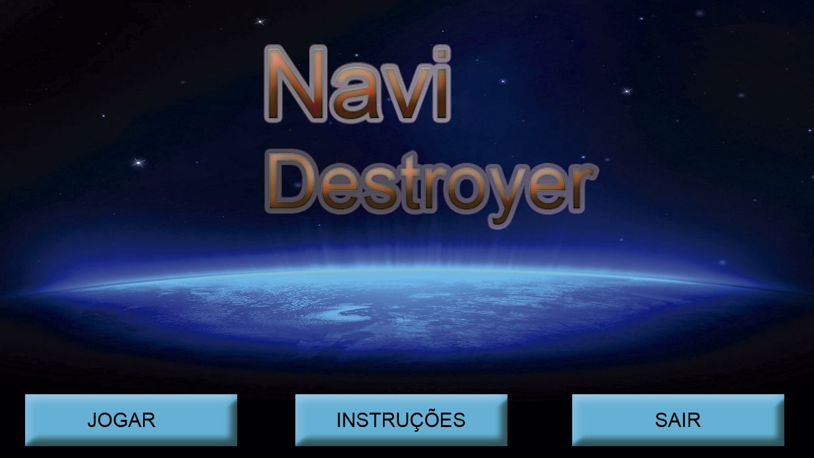

Navi Destroyer

Trata-se de um projeto antigo onde fiz um jogo utilizando linguagem C com auxílio da biblioteca Allegro para fins de estudo.

O jogo encontra-se num estado "incompleto", onde eu pretendia adicionar outras coisas como sons e outros detalhes, mas é jogavél de certa forma.

Para rodar o jogo é necessário:

- Dev C++ (de preferencia a versão abaixo de 5 para poder rodar com o allegro)

- Allegro 5

- se for versões do windows 8 ou superior, precisa do MinGW.

Eis o link para a instalação dos arquivos acima: https://www.youtube.com/watch?v=8UTPDuliDNE

Para rodar o jogo é preciso abrir o projeto dentro do Dev C++ e então executar o main.cpp

Não foi colocada a janela de instruções do jogo, mas é basicamente utilizar WASD para movimentar-se, mouse mira e com o clique esquerdo
atira. Os inimigos precisam de 3 tiros para serem destruidos, e se conseguir chegar aos 1000 pontos aparecerá um chefe final.

Bom jogo.
